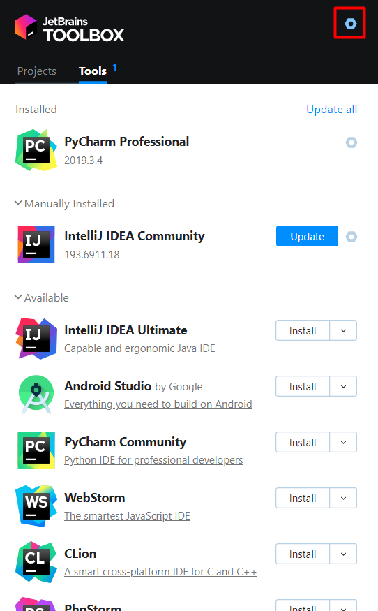
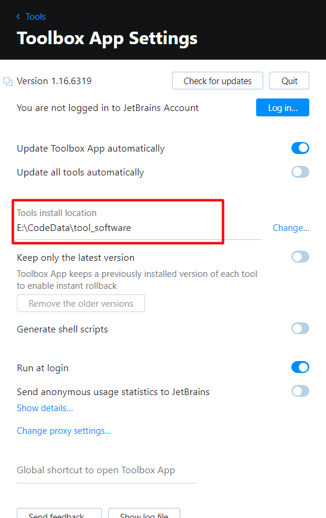

一、安装Jetbrain Toolbox
* 设置安装路径，安装pycharmz专业版（才有jupyter），不要放在C盘！
* 安装之后进行破解
  
  
  
二、配置anaconda的参考链接
https://www.baidu.com/link?url=qd7_QgX-Txp9yVYIv17gmgUT6_7x3EPsANksNApcWibJLaLo7MHpRth4_UlDsDBrf1gG4-xwo1unNQKShiuC8JRN-22DvIrXvojFuVopFoO&wd=&eqid=b04225a600083f6a000000065e8c6a3f
  * 其中，可以使用加速下载TensorFlow
    * pip3 install -i https://pypi.tuna.tsinghua.edu.cn/simple/ --upgrade tensorflow
  * 如果安装TensorFlow总是失败;提示six已经安装，卸载不掉，则使用下列语句
    * pip3 install -i https://pypi.tuna.tsinghua.edu.cn/simple/ --upgrade tensorflow --ignore-installed six

* 安装numpy的问题
   * 如果ImportError: numpy.core.multiarray failed to import  (版本太旧的缘故)
   * 则删除原来numpy的文件，重新pip install -i https://pypi.tuna.tsinghua.edu.cn/simple/ numpy